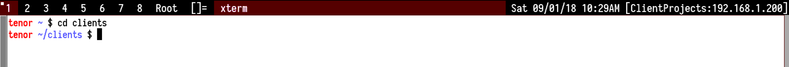
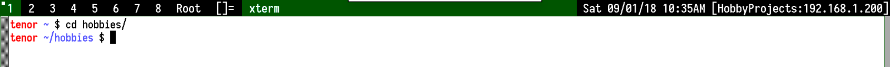
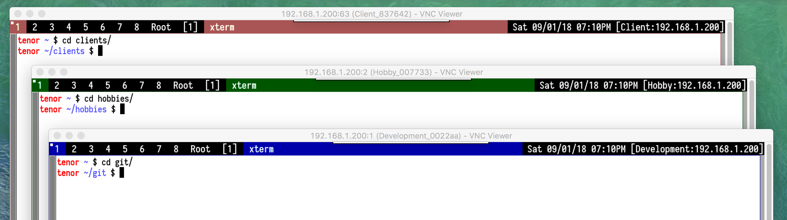

# My VNC setup

Runs [DWM](https://dwm.suckless.org).

## Colored Selection patch for DWM

Allows you to create VNC sessions with different colored selections to
distinguish between contexts.

For example, there are two examples for *Client* projects and *Hobby* projects.

-----

-----

There can be multiple VNCs with different colors.

-----

